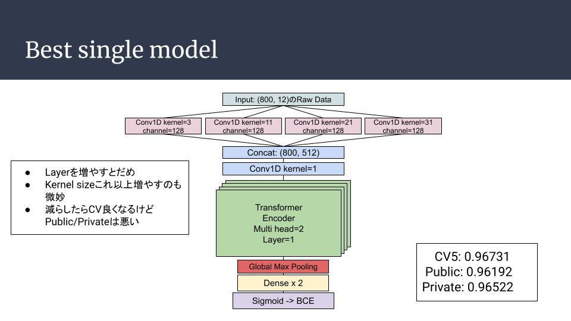
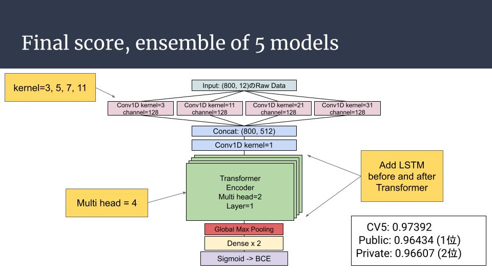

# AIMedical2021

# My Approach

Slides: [Link](https://docs.google.com/presentation/d/1bPCP5poQL8OuAu3CFpKwozEx6Ra-YHTJBICw4uWXsnU/edit?usp=sharing)

### Best Single Model


### Final Submit


# Environment

### Docker build
```
docker build -t aimedical2021:v0 ./
```

### Docker run
```
docker run -it --rm --name aimedical0\
 --gpus all --shm-size=100g\
 -v $PWD:/workspace\
 -p 8888:8888 -p 6006:6006 --ip=host\
 aimedical2021:v0
```

# Directory tree
```
AIMedical2021
|-- Dockerfile
|-- README.md
|-- data
|   |-- df_test.csv
|   |-- df_train.csv
|   |-- ecg
|   |-- sample_submission.csv
|   |-- test.csv
|   `-- train.csv
|-- eda
|   `-- eda001_create_fold.ipynb
|-- ensemble
|   |-- ensemble001.ipynb
|   `-- sub
|-- exp
|   |-- exp001
|   |-- exp002
|   |-- exp004
|   |-- exp009
|   `-- exp011   
`-- run.sh
```

# Train

```
sh run.sh
```

# Ensemble

See `./ensemble/ensemble001.ipynb`
